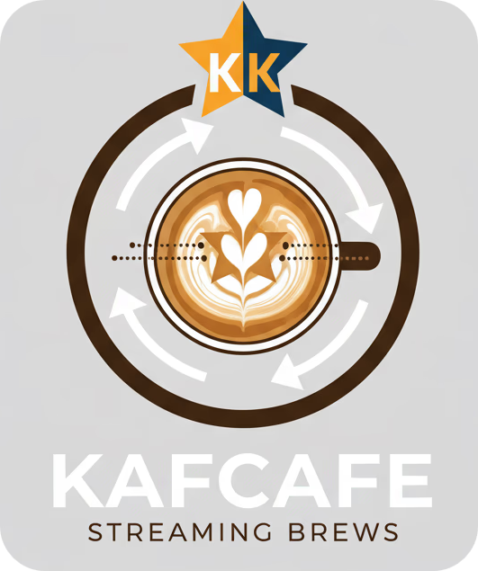

# Coffee Shop Analysis Distributed System

Distributed coffee shop data analysis system using Docker, RabbitMQ, and Go.

<p align="center">
    
</p>

### Team members

| Name                          | Padrón | Email              |
| ----------------------------- | ------ | ------------------ |
| Castro Martinez, Jose Ignacio | 106957 | jcastrom@fi.uba.ar |
| Diem, Walter Gabriel          | 105618 | wdiem@fi.uba.ar    |
| Gestoso, Ramiro               | 105950 | rgestoso@fi.uba.ar |

### Table of Contents

1. [Dependencies and Setup](#dependencies-and-setup)
1. [Dataset](#dataset)
1. [Commands](#commands)
   1. [Run and Logs](#Run-and-Logs)
   1. [Module Testing](#Module-Testing)
   1. [End2End Testing](#End2End-Testing)
   1. [Cleanup Commands](#Cleanup-Commands)

## Dependencies and Setup

You don't really need to have `golang` installed to run the project given all the nodes are Dockerized. `golang` is required to be installed on the local machine only for certain tasks (e.g. running tests natively or running `go mod tidy` manually).

You need to have the next dependencies installed:

- **Docker**: to run each container of each node in the system in a virtual machine with all the system requirements.
- **Docker Compose v2**: to orchestrate and simplify the boot up of the system and configure the environment variables in a proper way. You can distinguish if you have docker compose v1 or v2 based on the command name: `docker-compose` is v1 and `docker compose` is v2.
- **Make**: to simplify and automate the commands to run.
- **Python v3.12+**: to run the end2end tests that exercise the entire system. A basic version of Python is needed as well to generate the Docker Compose YAML file.

## Dataset

The system is designed to work with the next Kaggle dataset: https://www.kaggle.com/datasets/geraldooizx/g-coffee-shop-transaction-202307-to-202506/data, from now on reffered to as **the full dataset**.

Some info regarding the data:

> This dataset provides a synthetically generated, comprehensive record of coffee shop transactions spanning July 2023 to June 2025. It is specifically designed to simulate the crucial period following the launch of a new customer membership program and mobile application, offering a unique lens into the evolving dynamics of customer engagement and purchasing behavior.

For testing purposes, a reduced set of data is presented containing all necessary metadata (menu_items, payment_methods, stores, vouchers and users) and some transactions and transaction_items, this dataset will be called **the reduced dataset**:

```text
.
├── menu_items.csv
├── payment_methods.csv
├── stores.csv
├── transaction_items_202401.csv
├── transaction_items_202501.csv
├── transactions_202401.csv
├── transactions_202501.csv
├── users_202307.csv
├── users_202308.csv
├── users_202309.csv
├── users_202310.csv
├── users_202311.csv
├── users_202312.csv
├── users_202401.csv
├── users_202402.csv
├── users_202403.csv
├── users_202404.csv
├── users_202405.csv
├── users_202406.csv
├── users_202407.csv
├── users_202408.csv
├── users_202409.csv
├── users_202410.csv
├── users_202411.csv
├── users_202412.csv
├── users_202501.csv
├── users_202502.csv
├── users_202503.csv
├── users_202504.csv
├── users_202505.csv
├── users_202506.csv
└── vouchers.csv
```

## Commands

### Run and Logs

This script provides a user-friendly interface to the Python Docker Compose generator. It calls the Python script with provided arguments and interprets the exit codes to provide clear feedback to the user.

- `./scripts/gen.sh` - This script provides a user-friendly interface to the Python Docker Compose generator. It generates a Docker Compose YAML file with the number of nodes provided as arguments.

  Usage:

  ```shell
  ./scripts/gen.sh <output_file> <num_clients> <num_filters_by_year> <num_filters_by_hour> <num_filters_by_amount> <num_group_by_year_month> <num_group_by_semester> <num_join_items> <num_join_store> <num_topk>
  ```

  Usage example:

  ```shell
  ./scripts/gen.sh docker-compose-dev.yaml 1 1 1 1 1 1 1 1 1
  ```

  Expected output:

  ```text
  Compose file 'docker-compose-dev.yaml' generated with:
  - Clients: 1
  - Filters by Year: 1
  - Filters by Hour: 1
  - Filters by Amount: 1
  - Group by Year: 1
  - Group by Semester: 1
  - Join Items: 1
  - Join Store: 1
  - Join Users: 1
  - Top K: 1

  ✅ docker compose file generated successfully
  ```

- `make up` - Start all services with rebuild

  - Uses `docker-compose-dev.yaml` by default
  - Runs containers in detached mode with `--build` flag

- `make down` - Stop and remove all services

  - Gracefully stops containers with 3s timeout, then removes them

- `make logs` - View real-time logs from services
  - `make logs` - All services (default)
  - `make logs no-rabbit` - All services except rabbitmq
  - `make logs only-rabbit` - Only rabbitmq service
  - Follows log output continuously

#### Example on how to run the system, run these commands in order:

```shell
./scripts/gen.sh docker-compose-dev.yaml 1 1 1 1 1 1 1 1 1
```

> (or any other node number combination)

```shell
make up
```

```shell
docker compose -f ./docker-compose-dev.yaml logs client1 --follow
```

You will boot the whole system and check the live tail of logs coming from the `client1`.

### Module Testing

- `make test` - Run tests for common/middleware using Docker (no Go installation required)
  - Runs containerized tests with testcontainers support
  - Includes coverage reporting
- `make test-v` - Run tests with verbose output
  - Same as `make test` but with detailed test output
- `make raw-test` - Run tests directly with Go (requires Go installation)
  - Runs tests for common/middleware and filters/lib
- `make raw-test-v` - Run tests directly with Go and verbose output
  - Same as `make raw-test` but with detailed test output

**Note**: Containerized tests (`make test`) run in a Docker container and require Docker socket access for testcontainers. Raw tests (`make raw-test`) require Go to be installed locally.

### End2End Testing

- `make init-env` - Initialize Python virtual environment and install dependencies
  - Creates a `.venv` directory and installs packages from `tests/requirements.txt`
- `make activate-env` - Display instructions to activate the virtual environment
  - Prints command to run: `source .venv/bin/activate`
- `make deactivate-env` - Display instructions to deactivate the virtual environment
  - Prints command to run: `deactivate`
- `make pytest` - Run Python tests using pytest
  - Runs all tests in the `tests/` directory
- `make pytest-verbose` - Run Python tests with verbose output
  - Same as `make pytest` but with `-v -ss` flags for detailed output

**Note**: Python testing commands are used for full client execution end-to-end tests.

`make pytest-verbose` runs a series of tests that exercise the system end2end, regenerating the `docker-compose.yaml` files to try different node and client combinations. The tests are:

- `test_server_with_one_node_each`: 1 client, 1 node in each pipeline stage
- `test_server_with_two_nodes_each_full`: 1 client, 2 nodes in each pipeline stage
- `test_two_clients_one_each`: 2 clients, 1 node in each pipeline stage
- `test_three`: 3 clients, 3 nodes in each pipeline stage
- `test_five`: 5 clients, 5 nodes in each pipeline stage

First of all you need to have the dataset in a directory called `testData` in the root of the project. Eventually, the real client results are compared against the expected results for that dataset, which is composed of ~30% of the entire dataset, composed of the next files:

```text
.
├── menu_items.csv
├── payment_methods.csv
├── stores.csv
├── transaction_items_202401.csv
├── transaction_items_202402.csv
├── transaction_items_202403.csv
├── transaction_items_202404.csv
├── transaction_items_202501.csv
├── transaction_items_202502.csv
├── transaction_items_202503.csv
├── transaction_items_202504.csv
├── transactions_202401.csv
├── transactions_202402.csv
├── transactions_202403.csv
├── transactions_202404.csv
├── transactions_202501.csv
├── transactions_202502.csv
├── transactions_202503.csv
├── transactions_202504.csv
├── users_202307.csv
├── users_202308.csv
├── users_202309.csv
├── users_202310.csv
├── users_202311.csv
├── users_202312.csv
├── users_202401.csv
├── users_202402.csv
├── users_202403.csv
├── users_202404.csv
├── users_202405.csv
├── users_202406.csv
├── users_202407.csv
├── users_202408.csv
├── users_202409.csv
├── users_202410.csv
├── users_202411.csv
├── users_202412.csv
├── users_202501.csv
├── users_202502.csv
├── users_202503.csv
├── users_202504.csv
├── users_202505.csv
├── users_202506.csv
└── vouchers.csv
```

The exected results are located at `./tests/expected_results`.

#### Example on how to test the system, run these commands in order:

```shell
make init-env
```

```shell
make activate-env
```

It will prompt you to run:

```shell
source .venv/bin/activate
```

```shell
export REPO_PATH=$(pwd)
```

```shell
make pytest-verbose
```

The tests run on **the ~30% dataset**, so it may take a while for all the tests to finish. The results taken directly from the clients' files output are compared to the expected results for these tests.

### Cleanup Commands

> [!WARNING]
> Use with caution

- `make clean` - Basic cleanup (containers + unused images)
- `make clean-containers` - Remove all stopped containers
- `make clean-images` - Remove unused Docker images only
- `make clean-all-images` - Remove ALL Docker images (use with caution)
- `make clean-system` - Complete system cleanup including volumes
  - Removes everything: containers, images, volumes, networks
